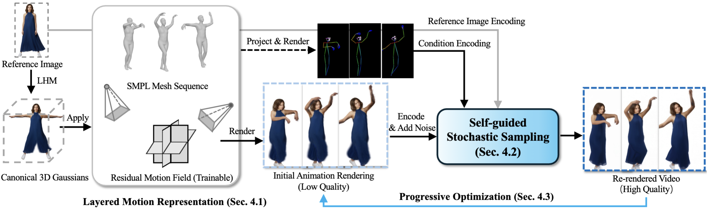

# Ani3DHuman: Photorealistic 3D Human Animation with Self-guided Stochastic Sampling (CVPR'26)


### [Paper (ArXiv)](https://arxiv.org/abs/2602.xxxx) | [Supplemental Material]()

This repository will contain the implementation of CVPR paper, Ani3DHuman: Photorealistic 3D Human Animation with Self-guided Stochastic Sampling.

Qi Sun1, Can Wang1, Jiaxiang Shang, Wensen Feng, Jing Liao1

1City University of Hong Kong


<video src="assets/supp_video_mask.mp4" controls="controls" width="100%">
</video>


## 📦 Code Availability

Due to internal review requirements, we are unable to release the code publicly at this time. If you need access to the code for research, please contact me (`qisun.new@gmail.com`) directly.

We are committed to updating the code to public access as soon as possible.

## :star2: Pipeline



## 📝 Citation

If you find our work useful for your research, please cite us:

```bibtex
@inproceedings{sun2026ani3dhuman,
  title={Ani3DHuman: Photorealistic 3D Human Animation with Self-guided Stochastic Sampling},
  author={Sun, Qi and Wang, Can and Shang, Jiaxiang and Liu, Yinchun and Liao, Jing},
  booktitle={CVPR},
  year={2026}
}
```
