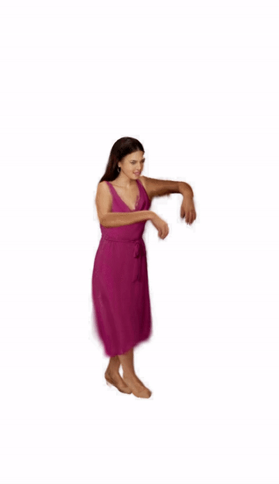
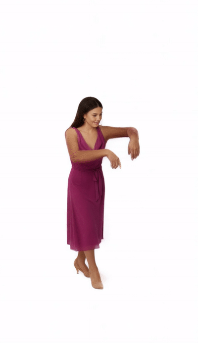
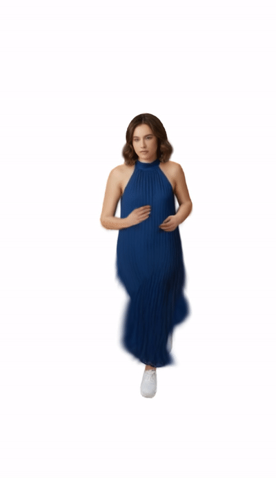
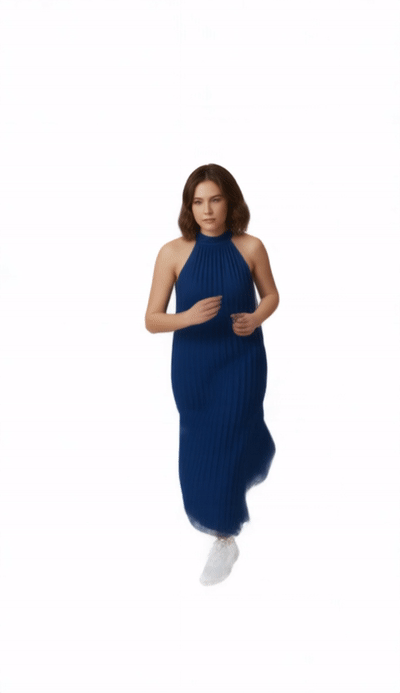
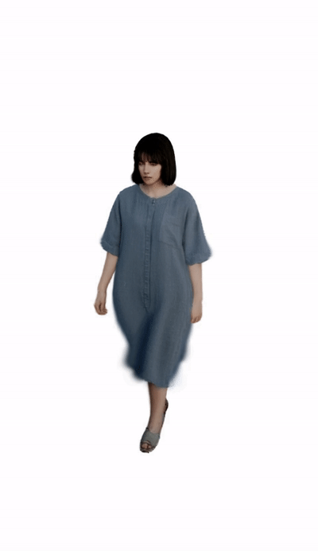
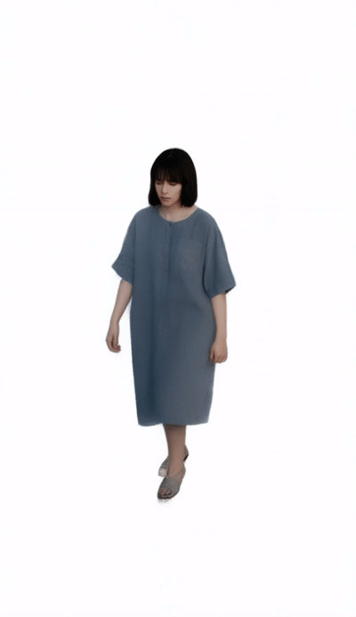

# Ani3DHuman: Photorealistic 3D Human Animation with Self-guided Stochastic Sampling (CVPR'26)


https://github.com/user-attachments/assets/b79ae0ba-1167-4ae6-9739-38841b727b5d


### [Paper (ArXiv)](https://arxiv.org/abs/2602.19089) | [Supplemental Material]()

This repository contains the official implementation of our CVPR paper, Ani3DHuman: Photorealistic 3D Human Animation with Self-guided Stochastic Sampling.

**Ani3DHuman** is a framework for high-fidelity 3D human animation. It leverages a novel **Self-guided Stochastic Sampling** strategy to restore coarse mesh-based renderings into photorealistic videos using video diffusion priors (Wan2.1).

Qi Sun<sup>1</sup>, Can Wang<sup>1</sup>, Jiaxiang Shang, Wensen Feng, Jing Liao<sup>1</sup>

<sup>1</sup>City University of Hong Kong


## :star2: Pipeline


-----

## � Qualitative Results

Comparison between the initial coarse rendering (Mesh-rigged) and our restoration results.

| Case | Coarse Rendering (Input) | Restoration (Ours) |
| :---: | :---: | :---: |
| **Dance - ID: g2** |  |  |
| **Run - ID: g3** |  |  |
| **Walk - ID: g5** |  |  |

> **Note:** To achieve the best performance, we recommend using the **Wan2.2-14B** model.

-----

## �🛠️ Environment Setup

### 1\. Installation

Clone the repository and install the dependencies:

```bash
git clone https://github.com/qiisun/ani3dhuman.git
cd ani3dhuman

# make sure the torch/torchvision/diffusers/transformers version consistent
conda env create -f environment.yml
conda activate sgss
cd DiffSynth-Studio
pip install -e .
cd ..
```

-----

### 2\. 🏡 Pretrained Model

Please download the necessary pretrained models and place them in the `models/` directory.

#### A. Video Diffusion & Control Models

We provide the pretrained **Wan2.1** (Video Diffusion) and **Wan-Control** weights in our Hugging Face repository.

  * **Repository:** [https://huggingface.co/qsun2001/sgss](https://huggingface.co/qsun2001/sgss)
  * **Action:** Download the models and place them into the `models/` folder.

You can download them easily using the CLI:

```bash
# Make sure you are in the project root
huggingface-cli download qsun2001/sgss --local-dir models
```

#### B. Grounded-SAM (Segmentation)

We use Grounded-SAM for preserved area masking. Please run the following script to download the checkpoints:

```bash
cd models/Grounded_SAM_2/checkpoints
bash download_ckpts.sh
cd ../../..
```

#### 📂 Expected Directory Structure

After downloading, your `models/` folder should look like this:

```text
models/
├── Wan-AI/
├── PAI/             
└── Grounded_SAM_2/
    └── checkpoints/
        ├── sam2.1_hiera_large.pt
        └── ...
```

-----

## 🚀 Usage

Run the restoration script with specific identity and motion IDs.

```bash
# Basic usage
python rerender.py --id g3 --motion walk2

# Optional arguments
python rerender.py --id g3 --motion run --use_14b
```

### Core Algorithm

The implementation of our **Self-guided Stochastic Sampling** algorithm can be found in:
📂 `DiffSynth-Studio/diffsynth/pipelines/wan_video_new.py`


## 📝 Citation

If you find our work useful for your research, please cite us:

```bibtex
@inproceedings{sun2026ani3dhuman,
  title={Ani3DHuman: Photorealistic 3D Human Animation with Self-guided Stochastic Sampling},
  author={Sun, Qi and Wang, Can and Shang, Jiaxiang and Liu, Yinchun and Liao, Jing},
  booktitle={CVPR},
  year={2026}
}
```
